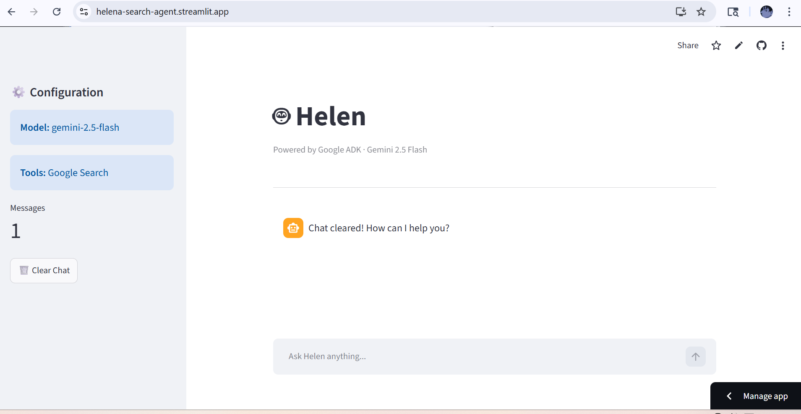
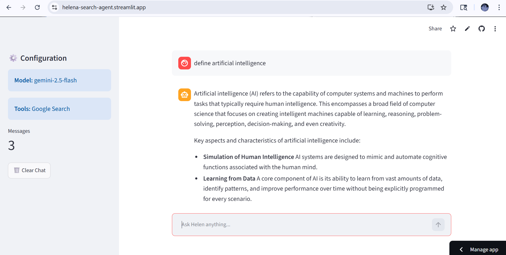

# Helena — Search-Enabled AI Assistant

Helena is a lightweight AI assistant built using Google's Agent Development Kit (ADK) and Gemini API.

The project demonstrates how modern AI systems can combine:

- Large Language Models (LLMs)
- external tools
- real-time information retrieval
- runtime orchestration

to create dynamic and context-aware conversational assistants.

Unlike traditional chatbots that rely only on pre-trained knowledge, Helena can dynamically invoke Google Search whenever current or external information is required.

---

## Features

- AI-powered question answering
- Web search support through Google Search
- Fast responses using Gemini 2.5 Flash
- Interactive Streamlit interface
- Built with Google ADK framework

## Screenshots





## Live Demo

https://helena-search-agent.streamlit.app/

## What is an AI Agent?

An AI agent is a system that uses an LLM as a reasoning engine and combines it with external tools to perform tasks dynamically.

Traditional chatbots mainly follow a simple workflow:

User Input → LLM Response

They generate responses only from information learned during training.

AI agents extend this idea by adding:

- reasoning
- decision making
- tool usage
- workflow execution

This creates a more dynamic system capable of interacting with external services and retrieving live information.

In Helena, the Gemini model acts as the reasoning engine while Google Search acts as an external knowledge retrieval tool.

---

## What Type of Agent is Helena?

Helena is a tool-augmented conversational AI agent.

It is considered "tool-augmented" because the Gemini model is given access to external tools, specifically Google Search.

This allows the system to:

- answer current-event questions
- retrieve live information
- access external knowledge beyond model training data
- generate more context-aware responses

The project demonstrates a foundational agentic AI workflow using:

- LLM orchestration
- tool calling
- API integration
- runtime execution

---

## Why Build AI Agents Instead of Using an LLM Directly?

A standalone Large Language Model (LLM) can generate responses based only on the knowledge learned during training.

### Direct LLM workflow:
```text
User Query
    ↓
   LLM
    ↓
Response
```
This works well for:

- general conversations
- explanations
- coding help
- summarization
- reasoning tasks

However, standalone LLMs have several limitations:

- knowledge can become outdated
- no access to real-time information
- cannot interact with external systems
- cannot perform actions dynamically
- limited workflow execution capability

AI agents extend LLM capabilities by integrating external tools and runtime orchestration.

## Agent workflow:
```text
User Query
      ↓
LLM Reasoning
      ↓
Decision Layer
 ┌───────────────┐
 │Answer Directly│
 │or Use Tool?   │
 └───────────────┘
      ↓
External Tool/API
      ↓
Retrieved Information
      ↓
LLM Response Generation
```

### This architecture enables the system to:

- retrieve live information
- interact with APIs
- execute workflows
- access external tools
- perform dynamic task execution

In Helena, the Gemini model acts as the reasoning engine while Google Search acts as an external knowledge retrieval tool.

### Example:

If a user asks:

"Who won yesterday's IPL match?"

A standalone LLM may not know the latest result because its training data is static.

Helena can:

1. detect that current information is required
2. invoke Google Search
3. retrieve live results
4. synthesize an updated response

This demonstrates the key advantage of agentic AI systems:
combining LLM reasoning with external capabilities.

Modern AI systems increasingly use agent architectures because they allow models to move beyond passive text generation into dynamic problem-solving and workflow execution.

----

# Technologies Used

| Technology | Purpose |
|---|---|
| **Python** | Core programming language |
| **Google ADK** | Agent orchestration framework |
| **Gemini API** | Large Language Model |
| **Google Search Tool** | Real-time information retrieval |
| **Kaggle** | Development environment |

---

## How Helena Was Built

The project was developed inside a Kaggle notebook environment using Google's ADK ecosystem.

### The workflow involved:

1. Installing Google ADK
2. Configuring Gemini API access securely using Kaggle Secrets
3. Importing ADK components such as:
   - Agent
   - Gemini model wrapper
   - InMemoryRunner
   - Google Search tool
4. Creating retry logic for stable API communication
5. Building the Helena agent
6. Connecting Gemini with Google Search
7. Executing the workflow through the ADK runtime runner

The project architecture separates:

- reasoning
- orchestration
- tool execution
- runtime management

which reflects modern AI engineering design principles.

---

## Core Components

### 1. Gemini LLM

Gemini acts as the reasoning engine of Helena.

Responsibilities include:

- understanding user queries
- generating responses
- deciding whether external tools are required
- synthesizing final answers

The project uses:

gemini-2.5-flash-lite

which is optimized for:

- fast inference
- lightweight execution
- low latency responses

---

### 2. Google Search Tool

The Google Search tool enables Helena to retrieve real-time external information.

Without this tool, the model would only respond using its pre-trained knowledge.

With tool integration, Helena can:

- access current information
- answer dynamic queries
- retrieve live web results

This transforms the system from a static chatbot into a tool-augmented AI assistant.

---

### 3. ADK Agent

The "Agent" object acts as the orchestration layer.

Responsibilities include:

- connecting the LLM with tools
- managing instructions
- coordinating execution flow
- handling interactions between components

The agent itself is not the intelligence source.

The reasoning capability primarily comes from the Gemini LLM.

---

### 4. InMemoryRunner

The "InMemoryRunner" acts as the runtime execution environment.

Responsibilities include:

- executing the workflow
- handling interactions
- managing temporary runtime state
- coordinating the complete query-response cycle

### 5.Helper Utilities

The project includes helper functions for improving execution inside the Kaggle notebook environment.

### 6.ADK Proxy URL Helper

A custom helper function was implemented to generate proxied URLs for accessing the ADK Web UI inside Kaggle.

Purpose:
- detect active Kaggle notebook sessions
- generate proxy-compatible URLs
- provide clickable UI access to the ADK runtime

This utility enables interactive visualization and debugging of the AI agent directly within the Kaggle environment.

Example:

```python
def get_adk_proxy_url():
    ...

```
The helper also dynamically renders an HTML interface with:
- setup instructions
- runtime guidance
- direct access links to the ADK Web UI

### 7.Installation

```bash
pip install google-adk
```

---

## Workflow Mechanism

Helena follows the workflow below:

#### Step 1 — User Query

The user submits a question such as:

"What is an AI agent?"

---

#### Step 2 — Query Sent to Runner

The query is passed into the ADK runtime runner.

The runner forwards the request to the Helena agent.

---

#### Step 3 — Gemini Reasoning

Gemini analyzes the query and determines:

- whether it can answer directly
- or whether external information is required

This reasoning process is guided by the system instruction:

Use Google Search for current information or if unsure.

---

#### Step 4 — Tool Decision

If real-time or external information is needed, Gemini decides to invoke the Google Search tool.

This process is called:

- tool calling
- function calling

The LLM itself determines when the tool should be used.

---

#### Step 5 — Search Execution

ADK executes the Google Search request and retrieves relevant information from the web.

---

#### Step 6 — Response Synthesis

The retrieved search results are returned to Gemini.

Gemini then:

- analyzes the information
- synthesizes relevant context
- generates a coherent natural-language response

---

#### Step 7 — Final Output

The final response is returned to the user through the ADK runtime.

---

## System Architecture

```text
User Query
      ↓
Helena Agent
      ↓
Gemini LLM
      ↓
Decision Layer
 ┌───────────────┐
 │Answer Directly│
 │or Use Search? │
 └───────────────┘
      ↓
Google Search Tool
      ↓
Search Results
      ↓
Gemini Response Synthesis
      ↓
Final Output

```
---

## API Integration

Helena communicates with Gemini through APIs.

An API (Application Programming Interface) acts as a bridge between software systems.

When a query is submitted:

1. the request is sent to Google's Gemini servers
2. Gemini processes the request
3. the generated response is returned to the notebook

The Google API key is used for:

- authentication
- access control
- request authorization

The project securely stores the API key using Kaggle Secrets instead of hardcoding credentials directly into the notebook.

---

### Reliability Features

The project includes retry handling using exponential backoff.

This improves robustness during:

- rate limits
- temporary server overload
- network interruptions

Retry logic automatically retries failed API requests for selected HTTP status codes such as:

- 429
- 500
- 503
- 504

This reflects real-world engineering practices used in production AI systems.

---
## Concepts Explored

This project explores several foundational AI engineering concepts:

- Agentic AI
- Tool-Augmented LLMs
- Runtime Orchestration
- API Integration
- Tool Calling
- Search-Augmented Generation
- Async Execution
- Prompt Engineering
- Secure Credential Management
- AI Workflow Design

---

## Future Improvements

Potential future enhancements include:

- Streamlit web interface
- Long-term conversational memory
- Multi-agent collaboration
- Voice interaction
- PDF summarization
- Retrieval-Augmented Generation (RAG)
- Source citation support
- Autonomous planning workflows

---

## Acknowledgement

Built during the Kaggle 5-Day Agentic AI Course using Google's Agent Development Kit (ADK) ecosystem.


